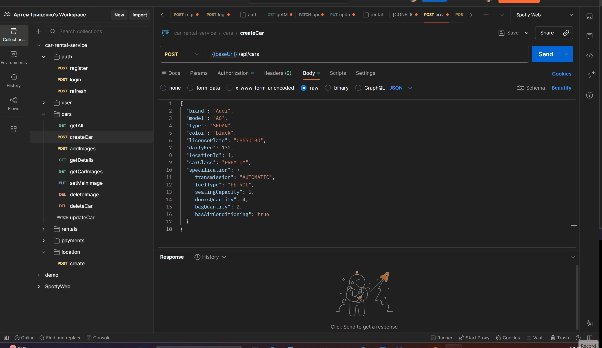
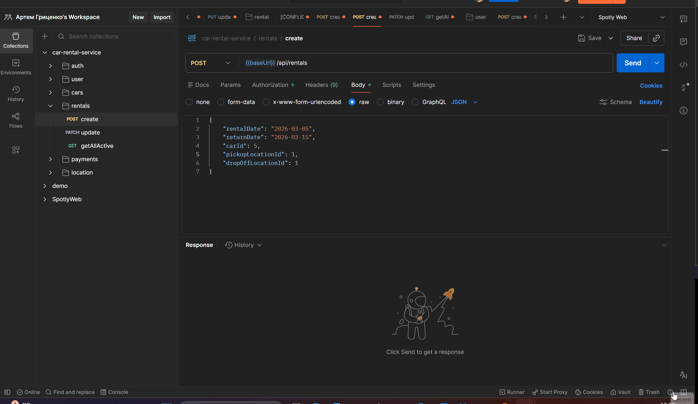
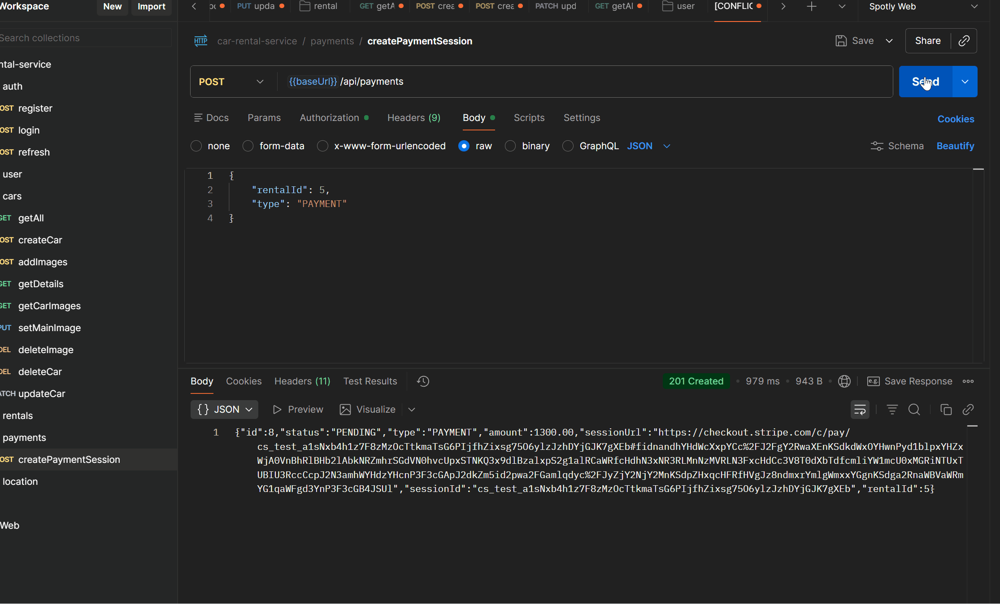
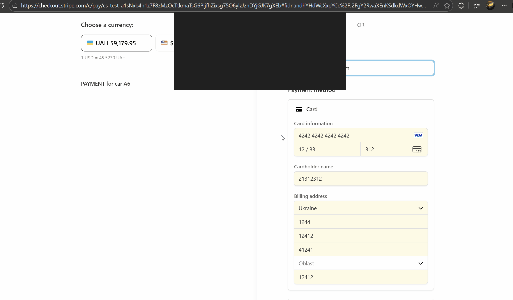
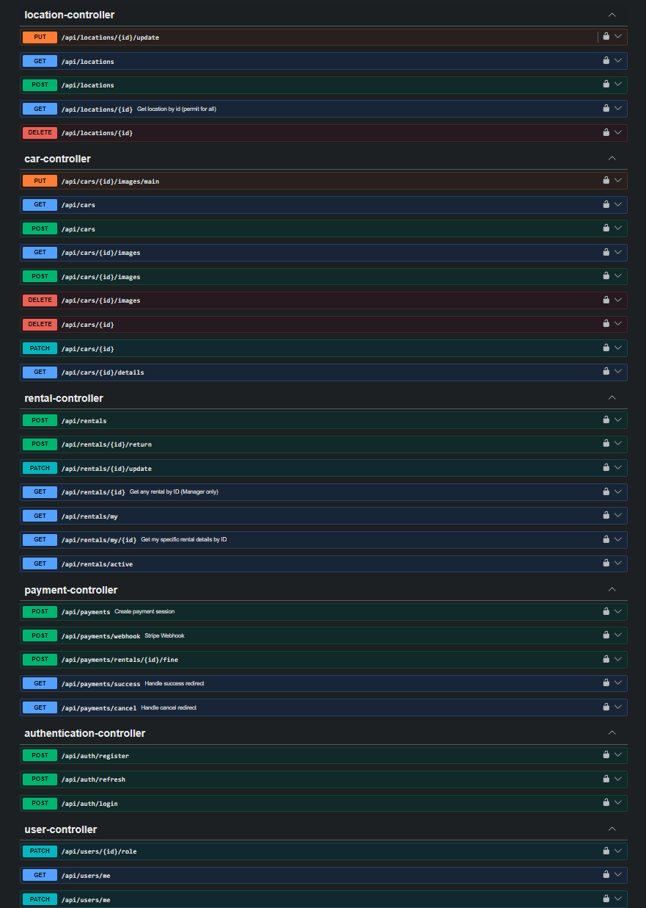
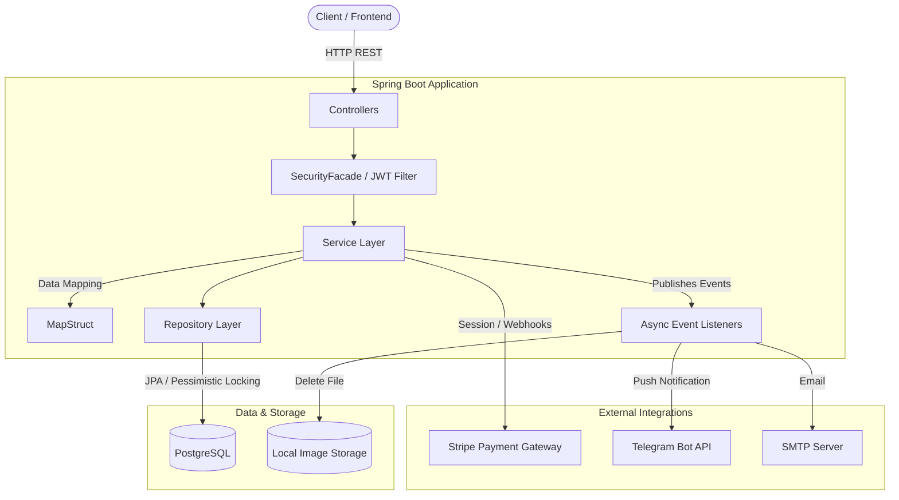

# 🚗 Car Rental Service API


An enterprise-grade, fully functional RESTful API for a Car Rental Service. This project goes beyond simple CRUD
operations by implementing complex business logic, third-party integrations, and addressing real-world concurrency,
resilience, and security challenges.

## 📸 Visual Showcase

### 🚗 Core Flows: Management & Booking

|                             Car Creation                             |                              Rental Creation                              |
|:--------------------------------------------------------------------:|:-------------------------------------------------------------------------:|
|  |  |

### 💳 Payment Integration (Stripe)

|                      1. Generating Payment Session                       |                      2. Stripe Checkout Execution                      |
|:------------------------------------------------------------------------:|:----------------------------------------------------------------------:|
|  |  |

### 🛠️ Documentation & Notifications

|                           Swagger UI                           |                           Telegram Admin Alerts                           |
|:--------------------------------------------------------------:|:-------------------------------------------------------------------------:|
|  |  |

---

## 🏗️ System Architecture

The application follows a clean, layered architecture with asynchronous event-driven components for background
processing.



## 🌟 Key Engineering Highlights

This project was built focusing on clean architecture and production readiness:

* **🛡️ Concurrency & Race Condition Handling:** Utilized **Pessimistic Locking** (
  `@Lock(LockModeType.PESSIMISTIC_WRITE)`) to prevent double-booking of the same vehicle during high-traffic scenarios.
* **⚡ Asynchronous Resilience (Bulkhead Pattern):** Engineered isolated Thread Pools (`ThreadPoolTaskExecutor`). I/O
  heavy tasks (like Telegram notifications) and Disk operations (like image folder deletions) are offloaded to separate
  background threads, ensuring the main business threads are never blocked.
* **🏗️ Clean Architecture & SOLID:** Implemented a robust layered architecture with strict separation of concerns.
  Ensured business logic isolation using custom validations (`@FieldMatch`, `@UkrainianCarPlate`), MapStruct for
  seamless DTO mapping, and explicit `SecurityFacade` abstractions to decouple services from the Spring Security
  context.
* **💳 Secure Payment Gateway (Stripe):** Fully integrated with Stripe API. Includes secure checkout session generation
  and **Webhook** processing for idempotent, asynchronous payment confirmations. Protected against IDOR vulnerabilities.
* **🔍 Advanced Dynamic Filtering:** Implemented JPA Criteria API (`Specification`) to allow complex querying of vehicles
  by nested `@Embeddable` properties (e.g., fuel type, transmission, AC) with B-Tree database indexes for high
  performance.
* **🤖 Automated Notifications:** Integrated Telegram Bot API to instantly notify managers regarding new rentals, late
  returns, and successful payments.
* **📧 Asynchronous Email Notifications**: Integrated JavaMailSender with Gmail SMTP to send automated HTML/Text emails
  for
  rental receipts.
* **📂 Local File Storage & Logging:** Configured dynamic multi-part file uploads for car images with automated directory
  generation. Implemented a robust Logback rolling file policy (size and time-based archiving) to ensure
  production-ready observability.

## 🛠️ Technology Stack

* **Core:** Java 21, Spring Boot 3.5.9, Spring Security, Spring Data JPA
* **Database:** PostgreSQL, Liquibase (Schema migrations & Indexing)
* **Integrations:** Stripe API, Telegram Bots API
* **Tooling:** Docker & Docker Compose, Swagger (OpenAPI 3.0), MapStruct, Lombok
* **Testing:** JUnit 5, Mockito, Integration Testing with Testcontainers

## 🗄️ Domain Architecture

* **Users:** Role-based access control (`CUSTOMER`, `MANAGER`, `ADMIN`) with secure JWT authentication.
* **Cars & Specifications:** Vehicles have detailed specifications (transmission, seats, etc.) using JPA `@Embeddable`
  to maintain clean Java code without sacrificing DB query speed and support multiple image uploads managed via local
  file storage.
* **Locations:** Tracking vehicle pick-up and drop-off points.
* **Rentals:** Lifecycle tracking from `PENDING` to `PAID` to `COMPLETED`.
* **Payments:** Handling standard rental fees and automatic fine generation for late returns.

## 💻 API Usage Example

##### Here is a quick example of how to create a new payment:

###### Request: POST /api/payments

````json
{
  "rentalId": 5,
  "type": "PAYMENT"
}
````

###### Response 201 CREATED

````json
{
  "id": 8,
  "status": "PENDING",
  "type": "PAYMENT",
  "amount": 1300.00,
  "sessionUrl": "https://checkout.stripe.com/c/pay/cs_test_a1sNxb4h1z7F8zMzOcTtkmaTsG6PIjfhZixsg75O6ylzJzhDYjGJK7gXEb#fidnandhYHdWcXxpYCc%2FJ2FgY2RwaXEnKSdkdWxOYHwnPyd1blpxYHZxWjA0VnBhRlBHb2lAbkNRZmhrSGdVN0hvcUpxSTNKQ3x9dlBzalxpS2g1alRCaWRfcHdhN3xNR3RLMnNzMVRLN3FxcHdCc3V8T0dXbTdfcmliYW1mcU0xMGRiNTUxTUBIU3RccCcpJ2N3amhWYHdzYHcnP3F3cGApJ2dkZm5id2pwa2FGamlqdyc%2FJyZjY2NjY2MnKSdpZHxqcHFRfHVgJz8ndmxrYmlgWmxxYGgnKSdga2RnaWBVaWRmYG1qaWFgd3YnP3F3cGB4JSUl",
  "sessionId": "cs_test_a1sNxb4h1z7F8zMzOcTtkmaTsG6PIjfhZixsg75O6ylzJzhDYjGJK7gXEb",
  "rentalId": 5
}
````

# 🚀 Getting Started

## Prerequisites

- [Docker](https://docs.docker.com/get-docker/) and Docker Compose installed.
- A [Stripe Developer Account](https://dashboard.stripe.com/register) (for API keys).
- A Telegram Bot Token (via [@BotFather](https://t.me/botfather)).

---

## Installation & Setup

### 1. Clone the repository

```bash
git clone https://github.com/humaNukr/Car-rental-service.git
cd Car-rental-service
```

### 2. Set up Environment Variables

Create a `.env` file in the root directory and add your specific credentials:

```env
# Database
POSTGRES_DB=car_rental_db
POSTGRES_USER=postgres
POSTGRES_PASSWORD=root

# Security
JWT_SECRET=your_super_secret_jwt_key_that_is_at_least_32_chars

# Mail (SMTP)
MAIL_USERNAME=your_email@gmail.com
MAIL_PASSWORD=your_google_app_password

# Stripe Integration
STRIPE_API_KEY=sk_test_your_stripe_key_here
STRIPE_WEBHOOK_SECRET=whsec_your_webhook_secret_here

# Telegram Bot
RENTAL_BOT_TOKEN=your_telegram_bot_token_here

# Application Routing
FRONTEND_URL=http://localhost:3000
BACKEND_URL=http://localhost:8080
```

### 3. Run the application

```bash
docker-compose up -d --build
```

The database and the Spring Boot application will start in separate containers. The API will be exposed on **port 8080
**.

---

## 📚 API Documentation (Swagger)

Interactive API documentation is generated automatically using **OpenAPI 3.0**.  
Once the application is running, explore endpoints and test requests directly in your browser:

👉 [http://localhost:8080/swagger-ui.html](http://localhost:8080/swagger-ui.html)

> **Note:** To test protected endpoints, register a user, log in to get a JWT token, and click the **"Authorize"**
> button in the top right corner of the Swagger UI.

---

## 🧪 Running Tests

The project is covered by unit and integration tests. To run them locally (requires Docker for Testcontainers):

```bash
./gradlew test
```

---

## 🧠 What I Learned

Building this project was a massive step forward in my software engineering journey. Key takeaways include:

1. **Dealing with Concurrency:** Moving beyond simple CRUD and realizing that in the real world, multiple users will try
   to rent the same car at the exact same millisecond. Learning Database Locking (`PESSIMISTIC_WRITE`) was an
   eye-opener.
2. **Third-Party Integrations:** Integrating Stripe wasn't just about calling an endpoint; it required understanding
   webhooks, idempotency (ensuring a payment isn't processed twice), and secure session management.
3. **Application Tuning:** Understanding that default Spring `@Async` threads can cause memory leaks if not configured
   correctly, and learning how to properly set up Custom Thread Pools (Bulkhead Pattern).

## 🔮 Future Improvements

While the core logic is solid, there is always room for growth:

* **Caching:** Implement Redis to cache the list of available cars, reducing the load on PostgreSQL for the most
  frequent read queries.
* **Microservices Evolution:** Decouple the Notification and Payment modules into separate microservices using RabbitMQ
  or Kafka for inter-service communication.
* **Frontend Integration:** Connect a React/Vue.js client to provide a complete user experience.

---


*Developed by **Artem Hrytsenko***
